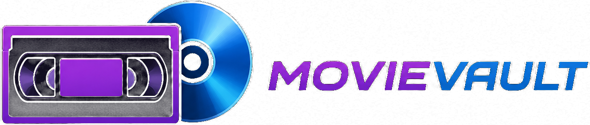

<h1 align="center">
MovieVault
</h1>

<b>Your Physical Movie Collection. Beautifully Organized.</b>

A premium Progressive Web App designed for collectors of physical movies.

DVD • Blu-ray • 4K Ultra HD • VHS • Steelbooks • Collector's Editions

---

# ✨ Overview

MovieVault transforms physical movie collecting into a modern digital experience.

Instead of managing DVDs and Blu-rays inside spreadsheets, MovieVault offers a premium interface inspired by today's best streaming platforms while remaining focused entirely on physical media.

Every detail has been designed around speed, simplicity and beautiful presentation.

---

# 🎬 Designed for Collectors

MovieVault supports virtually every type of physical release.

- 📀 DVD
- 💿 Blu-ray
- 🌌 4K Ultra HD
- 📼 VHS
- 📦 Collector's Editions
- 🟣 Steelbooks
- 🎁 Box Sets
- ⭐ Limited Editions

---

# 🚀 Features

## 📚 Collection

Build and organize your personal movie library.

- Unlimited movies
- Beautiful cover artwork
- Genres
- Runtime
- Release year
- Notes
- Shelf location
- Barcode support

---

## 📷 Barcode Scanner

Quickly add movies by scanning their barcode.

Fast.
Simple.
Accurate.

---

## ❤️ Wishlist

Save titles you plan to purchase.

Never lose track of upcoming releases.

---

## 🎲 Random Movie Picker

Can't decide what to watch?

MovieVault will choose one from your collection.

---

## ☁ Backup

Create complete backups of your library.

Restore everything in seconds.

---

## ⚡ Progressive Web App

MovieVault installs directly on your device.

✔ Offline support

✔ Home Screen installation

✔ Native-like experience

✔ Fast loading

✔ Automatic updates

---

# 🎨 User Experience

MovieVault combines modern UI trends into one cohesive experience.

- Dark cinematic interface
- Neon purple & blue accents
- Glassmorphism
- Responsive layouts
- Smooth transitions
- Mobile-first design
- Optimized for iPhone & Android

---

# 🛠 Technology

MovieVault is built using:

| Technology | Purpose |
|------------|---------|
| HTML5 | Frontend |
| CSS3 | Styling |
| Vanilla JavaScript | Application Logic |
| Google Apps Script | Backend API |
| Google Sheets | Database |
| Service Worker | Offline Cache |
| PWA | Mobile Installation |
| GitHub Pages | Hosting |

---

# 📈 Current Version

## MovieVault 3.5.2

### What's New

- Mobile UI redesign
- Improved iPhone support
- Responsive collection grid
- Enhanced logo
- Better typography
- Faster cache updates
- Refined cards
- Improved animations
- Optimized performance

---

# 🌍 Browser Compatibility

| Browser | Status |
|----------|--------|
| Chrome | ✅ |
| Safari | ✅ |
| Edge | ✅ |
| Firefox | ✅ |
| Samsung Internet | ✅ |

---

# ❤️ Philosophy

MovieVault isn't just another collection manager.

It's built around one belief:

> **Physical media deserves software as beautiful as the movies themselves.**

---

# 👨‍💻 Developer

Designed & developed by

**Kacper**

Poland 🇵🇱

---

# 📄 License

Copyright © 2026 MovieVault

All Rights Reserved.

MovieVault™ is a private software project.

No part of this software may be copied, modified or redistributed without permission.

---

### Thank you for visiting MovieVault.

⭐ If you like the project, don't forget to star the repository.

